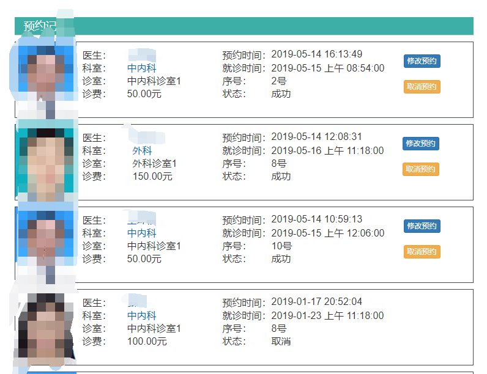
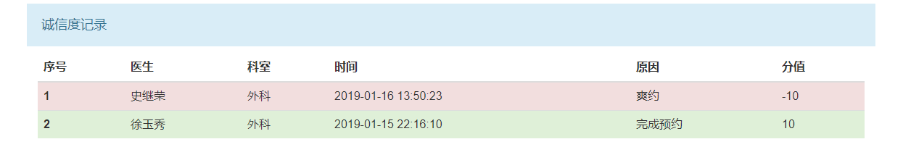
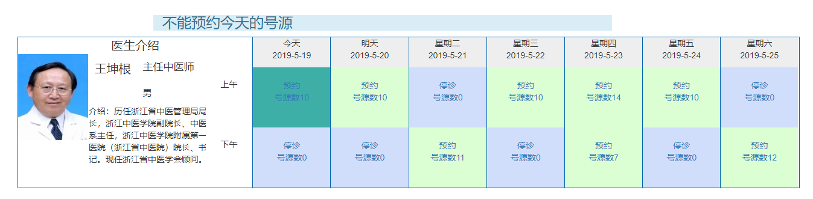
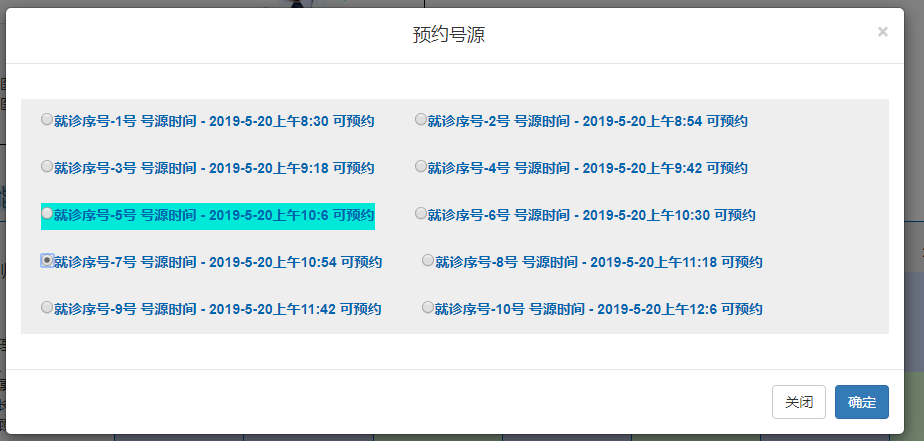
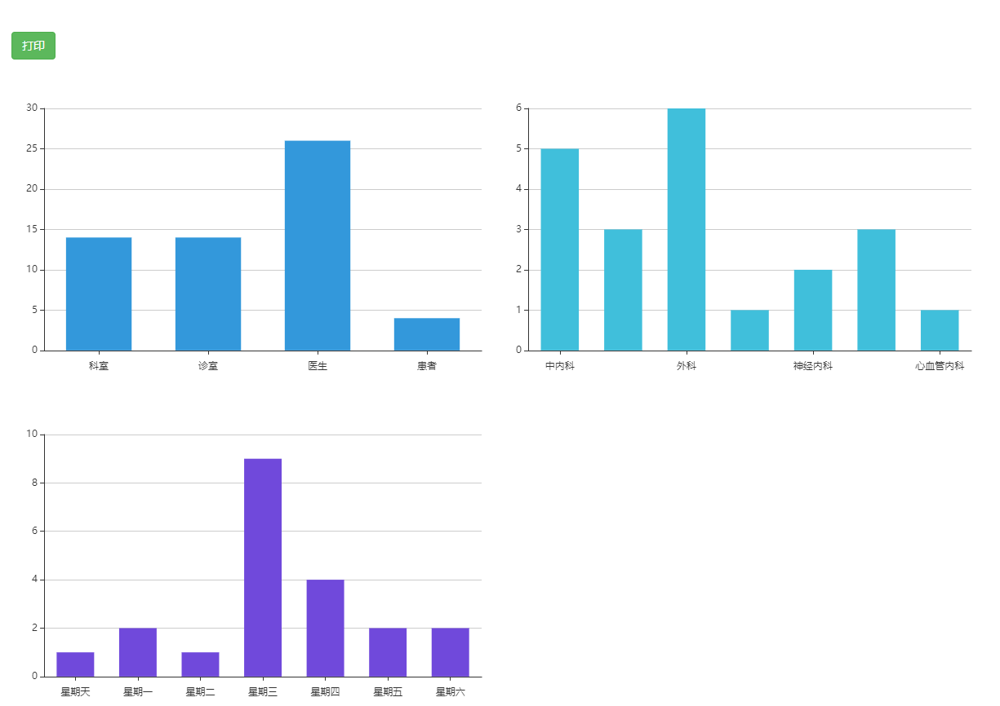

# 挂号预约系统
选题背景	现有某医院想要提升患者挂号管理水平，打算引入一套挂号预约管理系统。
功能需求	    挂号预约系统主要包括基础数据管理、预约管理、查询与统计分析三个子系统，具体要求如下。
## 1 基础数据管理子系统
基础数据管理子系统主要包括医生、患者、科室、诊室、号源池、医生排班、预约时段等信息管理。
所谓号源池，是指将每个科室中的每一当班医生的就诊数量进行统一管理的一种手段，即管理者将每个医生当班时段内的病人预约挂号数量进行统一调配，此外，还能够提供加号、锁号等功能，基本原则如下：
-- （1）先预约原则：任何方式预约均以提交时间节点为选取号的第一原则。
-- （2）开放全部号源原则。专家、专科、专病和多学科综合门诊均对各种预约方式开放且提供全部号源数。当天额满的依次顺延。
-- （3）现场预约可获取原则。因各种原因未能取得预约号且确有特殊情况的原则上以门诊部或一站式服务中心确认后予以现场加号，但不仅限于当日。
-- （4）预约号优先就诊。在同一时段内，优先诊疗预约病人，完成后诊疗现场挂号病人。如本时段预约额满时，加号和现场预约病人则在依次排列待预约病人完成后就诊。
-- （5）对于爽约病人采取一定的预约权限限制策略

## 系统用户按权限分为三种，即管理员、医生和患者。不同的用户拥有不同的权限，各自完成各自的管理功能，不同的用户看到不同的系统功能。
### 管理员：
（1）	登录功能：通过前台验证用户密码，验证成功后可以登录。
（2）	医生信息管理：具体包括医生信息进行维护。
（3）	患者信息管理：对患者信息进行维护。
（4）	科室信息管理：对医生所在科室进行维护。
（5）	诊室选课管理：对医生所在诊室信息进行维护。
（6）	号源池管理：对医生可预约的号源进行维护。
（7）	医生排班管理：对医生排班信息进行维护。
（8）	预约时段管理：对预约的时段信息进行维护
（9）	查询功能：登录后可查询到以上相应信息。
（10）	修改个人密码功能。
### 医生：
（1）	登录功能
（2）	基本信息查询：可以对本人信息、本人号源信息以及排班信息进行查询。
（3）	调班管理：可以申请调整排班（例如请假等，即停诊处理）。
（4）	患者队列查询：对患者的预约队列情况进行查询。
## 2预约管理子系统
本子系统主要针对患者角色。
### 预约管理具体内容如下：
（1）	信息查询：可以按多种方式对医生、科室的号源情况进行查询。
（2）	挂号预约：进行预约操作。
（3）	取消预约：可以对已经预约的挂号进行取消操作。
（4）	修改预约：可以调整预约信息（例如时段或者医生等）
（5）	诚信度查询：可以查看个人预约信誉度（医院要建立相应的诚信度机制）
### 3查询与统计分析子系统
（1）	不同角色可以根据相应的角色权限对相应信息进行查询操作。
（2）	管理员可以对患者的预约情况进行相应统计及分析操作，以便制定相应的排班策略。
（3）	能够将统计及分析结果生成相应报表，提供打印功能。
### 技术要求	
1.	基于MVC模式，运用JSP、JavaBean、HTML、CSS、Javascript等技术实现所设计的系统；
2.	使用SQL Server或MySQL作为后台数据库，依据数据库设计过程及规范，设计数据库表结构及主外键关系，并结合功能需求适当设计存储过程和触发器；
3.	采用面向对象设计方法学，运用所学的面向对象分析设计方法，以及对应的工具对系统进行分析与设计建模；
4.	基于模块化编程思想，程序源文件应划分为相应package，组织层次清晰；
5.	遵循程序设计编码规范，标识符应命名规范、代码注释充分、排版风格良好；
6.	使用JS对表单提交的数据及格式进行校验（是否为空、是否为数字等等）
7.	要求系统具有良好的安全性，能有效防止非法登录用户访问需授权网页。
8.	系统具有良好的人机交互界面，界面应布局清晰、简洁大方。
9.	系统具有较好的可操作性，界面友好。（例如：民族、部门、学院、班级等信息通过下来列表展示）
10.	系统具有良好的健壮性。例如：用户输入错误或者不按流程操作时系统不会异常退出。

患者预约记录

诚信度

